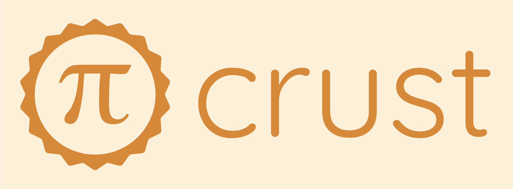

# Crust: Pi Coding Agent Extension for VS Code

Crust is an extension for Visual Studio Code that acts as a true UI for the [Pi Coding Agent](https://pi.dev/).

The goal of Crust is feature parity with existing similar extensions (like the [Claude Code extension](https://marketplace.visualstudio.com/items?itemName=anthropic.claude-code)).

## Features

> [!NOTE]
> Crust is a work in progress.

| Feature | Progress |
| ------- | -------- |
| Session browser | In development |
| IDE Context | In development |
| Chat export | In development |
| Diff viewer | In development |

## Requirements

Crust requires that Pi be installed and in your `PATH`.

---

> *S. D. G.*